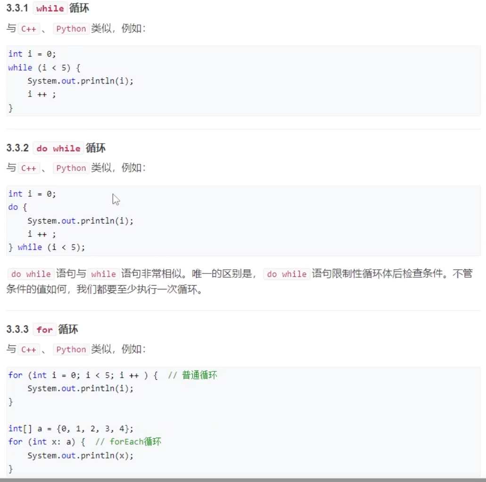
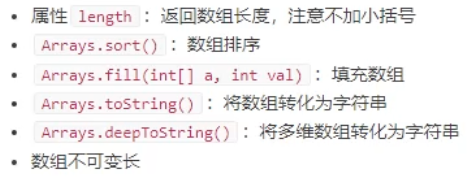
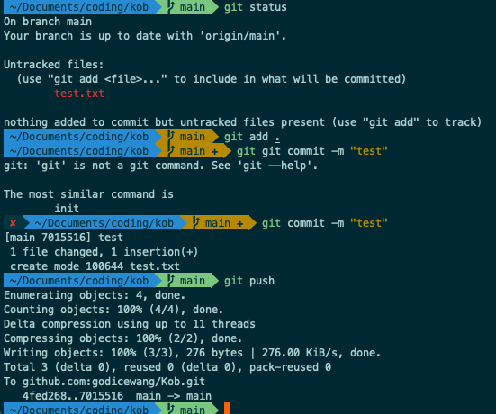

# （Y总）SpringBoot 框架


## 零：相关基础

### 1数据类型&Scanner

Scanner 属于引用数据类型——引用数据类型与定义基本数据类型变量不同，引用数据类型的变量定义及赋值有相对固定的步骤或格式：

```java
import java.util.Scanner;
数据类型	变量名 = new 数据类型（）；
Scanner   sc  =  new  Scanner(System.in);
//每种引用数据类型都有其功能，可以调用该类型实例的功能。
变量名.方法名();
sc.nextInt();
```


- 数据类型分为三种
  - 内置数据类型：byte、short、int、long...
  - 引用数据类型：类似 c/c++中的变量——引用类型指向一个对象，变量声明时被指定一个特定类型，声明后变量类型不能改变
    - eg：对象&数组
    - 引用类型默认值都是 null
  - 常量：类似 const（常量名通常大写）
    - final double PI = 3.1415726;


```java
package com.godice;

import java.util.Scanner;

public class Main{
    public static void main(String[] args){
        Scanner sc = new Scanner(System.in);
        byte b = sc.nextByte();//1Byte有符号整数
        short s = sc.nextShort();//2Byte有符号整数
        int i = sc.nextInt();//4Byte有符号整数
        long l = sc.nextLong();//8Byte有符号整数
        float f = sc.nextFloat();//4Byte浮点数
        double d = sc.nextDouble();//8Byte浮点数
        boolean bool = sc.nextBoolean();//布尔值
        char c = (char) sc.nextInt();//2Byte URL 编码字符
        String str = sc.nextLine();//字符串和字符数组，java 中不是一个东西
        //初始化定义
        long l1 = 64646455564656L;//long 定义需要末尾加上L
        float f1 = 11.312F;//浮点数定义需要加上F,否则默认定义为 double
        double d1 = 1231.123123D;//double 需要加上D
        boolean bool1 = true;//boolean值定义只能为 true/false，不能为数字
        char c1 = 'a';
        char c2 = (char) 123;
        char c3 = '&';//char可以存储任何字符
        String str1 = "Hello World";
        System.out.println(b);
        System.out.println(s);
    }
}
```


**默认值**

 


## 一：java 语法


### JDK、JRE、JVM

- jdk 包含 jre、jre 包含 jvm
  - jdk：java 开发工具包
    - jdk = jre + 常用编译&调试工具
  - jre：java runtine environment java——java运行环境
    - jre = jvm + 常用库&包
  - jvm：java 虚拟机（java 的解释器）


### JSE、JEE、JME


Spring 是 JSE 上开发的JEE 的轻量级替代品 

Spring 配置很麻烦——SpringBoot 是Spring 的自动化配置


### 数据类型

（所有变量函数都需要定义在 class 中、没有全局变量/函数的概念）


- byte：有符号单字节整数：-128——127（2^7）
- short：有符号双字节整数：-32768——32767（2^15）
- int：-2^31——2^31 - 1
- Long：-2^63——2^63 - 1
  - 常量类型的 long 需要在结尾加上 L
- float：直接定义的小数默认都是 double——float 后面需要加上F
- double：需要强制定义为 double 类型，后面需要加上 D
- boolean：true/false
- char ：是两个字节
- String：字符串（注意是大写S）


### 类型转换

分为显式转换、隐式转换、强制类型转换


显示类型转换

 

隐式类型转换(低精度可以向高精度，反之不能)

 


隐式转换 ——4 是整型，被转为了 double，再进行运算

 

强制类型转换(结果 9)

  


### 输入

 


#### Scanner

- scanner：中的 next 方法
  - next：读入字符串，不包含空格
  - nextLine：读入一行，可以包含空格
  - nextbyte：读入一个 byte


1：需要导入包（idea会提醒）

2：类名的首字母都需要大写，不然会报错

 

上例输出：因为只读入字符串，空格分割


#### BufferedReader

比 Scanner 快很多，使用需要抛异常


例子：注意需要抛异常 


运行：read是读入一个字符的 ascci 码，readLine 是读入一行

 


#### BR读入整数

BufferedReader 


一行单数：


一行多个整数


#### 连续读入整数（并输出）


**流输出整数：**


结果：这里 bw.write输出的是字符串

 


### 输出

#### System.out.println

（效率较低、小规模）


System.out.println()：可以输出所有类型，同时会自动补一个换行

System.out.print()：就没有换行


System.out.printf()**格式化输出：**


结果：保留 2 位&不足补 0


#### BufferedWriter

和 BufferedReader 一样——需要抛异常、同时需要手动刷新缓冲区（不然不一定有输出）

（需要手动换行）


示例：异常、手动换行、刷缓存


打印

 


### 1.2判断/分支/逻辑/循环

判断：


逻辑表达式：

（java 中int 值不能做逻辑判断，必须是布尔值 boolean）


分支语句：swich

（输出 1234567 星期单词）

如果不 break，第一个满足的话，后面的都会输出

 


**循环**




**循环遍历数组**

数字数组

 

对象数组

 


### 1.3 数组

#### 1.3.1 基础概念

**初始化**

- 数组定义：动态定义，但是定义后就不可变长
- 初始化方式：
  - new
  - 初值初始化
- 初始值（如果用 new 的方式初始化）：
  - int：默认初始化为 0
  - 字符串：默认初始化为空字符串
  - float：默认初始化为 0.0
- 字符数组和字符串


```java
//数组new 方式初始化
int[] a = new int[5];
int n = 10;
float[] b = new float[n];
//初值方式初始化
char[] c = {'a', 'b', 'c'};
char[] d = c;//数组赋值：（引用）赋的是地址（内存中是同一段地址）
d[1] = 'x';
int[] e = {1, 2, 3, 4, 5};//遍历数组
for(int i:e){
    System.out.println(i);
}
System.out.println(c);
System.out.println(c.hashCode());
System.out.println(c.hashCode());//hashCode是返回内存地址的哈希值
/*
输出如下：
1
2
3
4
5
axc
1808253012
1808253012
*/
```


**数组读写**

 


**多维数组**

```java
int[][] a = new int[2][3];
a[1][2] = 3;
int[][] b ={
        {1, 2, 3},
        {4, 5, 6}
};
System.out.println(Arrays.toString(c));
System.out.println(Arrays.toString(a));//输出数组所在对象的内存地址
System.out.println(Arrays.toString(b));//toString 只对一维数组有用
System.out.println(Arrays.deepToString(a));//多维需要 deepToString
System.out.println(Arrays.deepToString(b));
/*输出值如下
[1, 2, 3]
[[I@6bc7c054, [I@232204a1]
[[I@4aa298b7, [I@7d4991ad]
[[0, 0, 0], [0, 0, 3]]
[[1, 2, 3], [4, 5, 6]]
*/
```


**数组长度**

```java
int[] a = new int[10];
for(int i = 0;i < a.length; i++){
    a[i] = 10;
}
```


#### **1.3.2常用 API**

 

```java
//数组排序
int[] a = {5, 2 , 3, 1, 10};
Arrays.sort(a);
System.out.println(Arrays.toString(a));
System.out.println(a);//直接打印是打印地址
Arrays.fill(a, 100);//a 数组全部赋值为 100
```


#### 1.3.3数组逆序（匿名函数）


 


### 1.4字符串String


**java中所有对象的赋值都是传引用（地址）**


**java 中的 String 是不可变的（只读变量）**：

str1 后面加上一个 str2，不是在 str1 后面加上 str2——而是创建一个新的地址接收这个字符串


##### 基础定义

```java
//等价命名
String a = "Hello World";
String b = new String("Hello World");

//赋值
String c = "My Name is ";
String x = b; // x 和 b 的地址相同
System.out.println(b.hashCode());
System.out.println(x.hashCode());

//加法
String d = c + "wyy";
System.out.println(d);

//默认转换
String e = "My age is " + 18;//数字 18 默认转换为了字符型

//其他类型转String
String str = String.format("My age is %f",18.16456);
System.out.println(e);

//String 转其他类型
String pi_str = "3.1415926";
double pi = Double.parseDouble(pi_str);
String in_str = "123";
int in = Integer.parseInt(in_str);
//Float.parseFloat();   Long.parseLong();

//String 是只读变量，不能被修改，这里被重载了，是计算字符串的哈希值，但是懂不可变性意思就行
String f = "Hello";
System.out.println(f.hashCode());
f += " World";
System.out.println(f.hashCode());

//遍历字符串（字符串的长度需要加括号，数组的长度不需要）
//只能读取，不能写入
String s = "Hello World";
for(int i = 0; i < s.length(); ++i){
  System.out.println(s.charAt(i));
}
//也可以转换为char/String数组后遍历
String s = "Hello World";
char[] arr = s.toCharArray();
for(int i = 0; i < arr.length; i++){
    System.out.printf("%s",arr[i]);
}
System.out.println();
String[] arr2 = s.split("");
for(int i = 0; i < arr2.length; i++){
    System.out.printf("%s",arr2[i]);
}
```

 


##### **常用 API**

注意：对字符串的新操作，都没有改变原字符串的值

需要用新的字符串接受操作改变后的字符串or 直接输出它

```java
//split分割字符串，split 支持正则表达式
String a = "Hello World a !";
String[] arr1 = a.split("");//遍历字符串
for(int i = 0; i < arr1.length; i++){
	System.out.printf(arr1[i]);//Hello World a !
}
System.out.println();
String[] arr2 = a.split(" ");//分割字符串
System.out.println(Arrays.toString(arr2));//[Hello, World, a, !]
//split的正则表达式版本
String a = "Hello      World";
String[] arr1 = a.split("\\s+");//匹配多个空白字符
System.out.println(Arrays.toString(arr1));
String[] arr2 = a.split("[ ]+");//也是匹配多个空白字符
System.out.println(Arrays.toString(arr2));


//indexOf定位字母
System.out.println(a.indexOf('o'));//4
System.out.println(a.indexOf("Wo"));//6


//equals、compareTo比较字符串
//相等 equals
String a = "aaa", b = "bbb";
System.out.println(a.equals(b));//不能直接用a == b比较，这样比较的是地址值
//可以比较大小关系compareTo
String a = "aaa", b = "bbb";
System.out.println(a.compareTo(b));//负数b 小于 a，0 相等，正数 b 大于 a

//startsWith判断以字符串开头
//endsWith以字符串结尾
String a = "abcde";
System.out.println(a.startsWith("abc"));//true
System.out.println(a.startsWith("abe"));//false

//a.trim();去掉首位空白字符
//a.toLowerCase()全部转为小写
//a.toUpperCase()全部转为大写


//替换字符：替换某一个字符/替换字符串
String a = "abcabc";
a.replace('a', 'x');
System.out.println(a)//这里输出的还是 abcabc
System.out.println(a.replace('a', 'x'));//a 全部替换为x  输出xbcxbc
System.out.println(a.replace("ab", "x"));//ab全部替换为 x 输出xcxc


//substring()取子串[)左闭右开，从 0 开始计数
String a = "abcabc";
System.out.println(a.substring(2,4));ca
```

 


##### 动态长度

String不可动态变长，每次改变都是在内存创建新对象

```java
String s = "";
for(int i = 0; i < 10000; ++i){
  s += "a";
}
System.out.println(s);
//n^2级别复杂度，每次改变都是创建新对象
```


##### Builder、Buffer

(算法题可以用 Builder，项目用 Buffer)

StringBuffer（线程安全、速度慢）、StringBuilder（线程不安全、没有加锁、效率更高）

**多线程用 StringBuffer、单线程用 StringBuilder**

```java
StringBuffer sb = new StringBuffer();
for(int i = 0; i < 2000000; ++i){
    sb.append('a');
}
System.out.println(sb);
```


**常用 API：反转reverse**

```java
StringBuilder sb = new StringBuilder("abcdef");
sb.reverse();//在自己上面修改，没有创建新的对象
System.out.println(sb);//所以可以修改后再输出，不用接收
```


**取值和赋值**

```java
StringBuffer sb = new StringBuffer("abcdefg");
for(int i = 0; i < sb.length(); ++i){
    sb.setCharAt(i, (char)(sb.charAt(i) + 1));
}
System.out.println(sb);//bcdefgh
```


### 2 函数

#### 2.1基础概念

**静态函数里面：只能调用静态变量和静态函数**


- **java 中的函数必须定义到类中**
  - static 函数：绑定到这个类上
    - new的不同实例共用一个函数（全局函数）
  - 不加 static 函数
    - 不同的实例拥有不同的函数
- 变量也是类似的：private int x; private int static y
  - 不同的实例a、b、c 分别拥有各自的 x
  -  a、b、c 共用一个 y


 


#### 2.2 用法示例


数组初始化函数：

```java
package com.godice;

import java.util.Arrays;
import java.util.Scanner;

public class Main{
    public static void main(String[] args){
        int[][] a = getArray2d(3, 4, 12);
        System.out.println(Arrays.deepToString(a));


    }
    //返回最大值
    private static int max(int a, int b){
        return a > b ? a : b;
    }

    //数组赋初值
    private static void fill_arr(int[][] a, int val){
        for(int i = 0; i < a.length; ++i){
            for(int j = 0; j < a[i].length; ++j){
                a[i][j] = val;
            }
        }
    }

    //创建二维数组（并赋初值）
    private static int[][] getArray2d(int row, int col, int c){
        int[][] res = new int[row][col];
        for(int i = 0; i < res.length; ++i){
            for(int j = 0; j < res[i].length; ++j){
                res[i][j] = c;
            }
        }
        return res;
    }
}
```


#### 2.3 全局变量

java 中没有全局变量，可以设置一个全局变量的类来处理


#### 2.4 访问控制

##### 2.4.1基础概念


**说明：**

需要特别说明“无修饰符”这个情况，子类能否访问父类中无修饰符的变量/方法，取决于子类的位置。如果子类和父类在同一个包中，那么子类可以访问父类中的无修饰符的变量/方法，否则不行。


##### 2.4.2静态变量的访问


**静态变量/函数，访问的时候，用类名访问**

**普通变量/函数，访问的时候，用具体实例访问**

（静态绑定到唯一的类上，普通的每一个实例有一个）

```java
class Argument{
    public static int x = 1;//全局变量
    public final static int y = 2;//全局常量
}

public class Main{
    public static void main(String[] args){
        System.out.println(Argument.x);
        System.out.println(Argument.y);
    }
}
```


##### 2.4.3静态函数的访问

- 静态变量
  - 一个类中只有一个，其绑定到该类名上
  - 本类初始化了多个实例
    - 这多个实例也共享同一个静态的变量


- 函数加不加 static 的区别
  - 有 static：绑定到类名上
    - 通过类名进行访问函数
  - 无 static：绑定到具体的对象熵
    - 通过实例进行访问

```java
package com.godice;

class Node{
    public void f(){
        System.out.println("This is function f(no static)");
    }

    public static void g(){
        System.out.println("This is function g(static)");
    }
}


public class Main{
    public static void main(String[] args){
        Node node1 = new Node();
        node1.f();
        //node1.g();用实例访问静态函数可以用，但是会提示：g()是static的，用Node.g();访问比较好
        Node.g();
        node1.g();
        //Node.f();从类名访问非静态函数，会报错
    }
}
```


##### 2.4.4 static访问特性


**1：一个类中的static 函数如果访问本类中的函数和变量，只能访问static 函数和 static 变量**

（访问其他类的不受限制）

静态方法只能直接访问静态成员，无法访问非静态成员，如果想要访问非静态方法，则实例化该类对象，使用对象名.非静态方法()的方式来访问！

static是一种访问修饰符，在java中可以修饰代码块、方法和属性
1、静态块：用于在类加载之前完成一些初始化操作，仅会执行一次

2、静态方法：可以使用类名和对象调用，只能直接访问静态成员，无法访问非静态成员

3、静态属性：可以使用类名和对象名调用，多个对象共享

```java
import java.io.*;
import java.util.*;
 
public class Main{
	public static void main(String args[]) throws Exception{
		f();
  }
	
	boolean f() {
		return true;
	}
}
```


  

```java
import java.io.*;
import java.util.*;
 
public class Main{
    public static void main(String args[]) throws Exception{
				Main main = new Main();
				main.f();
    }
	
    boolean f() {
				return true;
    }
}
```


**2：static可以节省内存**

因为对于一个类，new 多个实例，但是 static 函数也只储存了一份


### 3类与接口


#### 3.1 类


##### **源文件声明规则**

 

每一个源文件中只能有一个 public 类，且类名应该和文件名相同

     


##### 类的定义

 


一个点类

```java
package com.godice;

import java.util.Scanner;


//定义一个点类
class Point{
    private int x;
    private int y;

    public Point(int x, int y){//构造函数，用做初始化
        this.x = x;
        this.y = y;
    }

    public Point(int x){//构造函数可以有多个，这里只进行 x 的初始化
        this.x = x;
    }
    //因为 xy 都是私有的，访问和修改都需要通过类中的公有方法
    public int getX(int x){
        return this.x;
    }
    public int getY(int y){
        return this.y;
    }

    public void setX(int x) {
        this.x = x;
    }
    public void setY(int y) {
        this.y = y;
    }
    //打印点
    public void printPoint(){
        System.out.printf("(%d,%d)", this.x, this.y);
        System.out.println();
    }

    //返回字符串格式
    public String toString() {
        return String.format("toString change value is (%d, %d)", x, y);
    }
}


public class Main{
    public static void main(String[] args){
        Point point1 = new Point(1,2);
        point1.printPoint();
        Point point2 = new Point(3);
        point2.printPoint();
        System.out.println(point1.toString());
    }
}
```


##### 类的继承

super在子类中表示父类的引用

eg：需要定义一个带颜色的点：相对于上一个点类，只多了颜色的属性

​	就不用重写逻辑，直接继承即可


```java
package com.godice;

import java.util.Scanner;


//定义一个点类
class Point{
    private int x;
    private int y;

    public Point(int x, int y){//构造函数，用做初始化
        this.x = x;
        this.y = y;
    }

    public Point(int x){//构造函数可以有多个，这里只进行 x 的初始化
        this.x = x;
    }
    //因为 xy 都是私有的，访问和修改都需要通过类中的公有方法
    public int getX(){
        return this.x;
    }
    public int getY(){
        return this.y;
    }

    public void setX(int x) {
        this.x = x;
    }
    public void setY(int y) {
        this.y = y;
    }
    //打印点
    public void printPoint(){
        System.out.printf("(%d,%d)", this.x, this.y);
        System.out.println();
    }

    //返回字符串格式
    public String toString() {
        return String.format("toString change value is (%d, %d)", x, y);
    }
}

//带颜色的点类，继承自父类
class ColorPoint extends Point{
    private String color;
    public ColorPoint(int x, int y , String color){
        super(x,y);//这里调用父类的构造函数
        this.color = color;
    }
    public String getColor(){
        return color;
    }
    public void setColor(String color){
        this.color = color;
    }
    //转换字符串
    public String toString() {//如果没有重写，就调用父类的方法，如果重写了，则覆盖
        return String.format("(%d, %d, %s)", super.getX(), super.getY(), color);
    }
}

public class Main{
    public static void main(String[] args){
        Point point1 = new Point(1,2);
        point1.printPoint();
        Point point2 = new Point(3);
        point2.printPoint();
        System.out.println(point1.toString());
        //colorPoint
        ColorPoint cpoint1 = new ColorPoint(1,2, "blue");
        //System.out.printf("%s & color is %s \n", cpoint1.toString(), cpoint1.getColor());
        System.out.println(cpoint1.toString());
    }
}
```


##### 多态

一个子类的对象colorPoint，可以放到一个父类Point的引用上

（多态即基于此）

 


- 多态：同一个类的同一个函数，会有不同的行为
  - 两个类的引用都是 Point，但是第一个类（new）的对象是一个 Point，第二个类（new）的对象是一个 ColorPoint
  - 第二个类就会优先调用 colorPoint 类的 toString方法

 


#### 3.2 接口

（接口中的方法只能用 public）

接口中的方法，一般不放函数体（即具体实现），函数体一般是放在具体的使用接口的类


**Ctrl + 回车 可以快速实现类中的接口**

##### 3.2.1 接口作用

定义某些类，必须实现的函数（方法）——规范性、多人协作

- 接口interface与类 class 类似
  - 约定俗成：
    - 类包含方法和变量
    - 接口只包含（函数）方法：一般不包含变量（也可以包含变量）
  - 接口不能实例化对象：接口是不能有实例的
  - 接口的作用：用来规范类的（主要用于多人协作）
    - 使用了该接口的类，必须实现接口所定义的方法（函数），否则编译器会报错


接下来分为三个部分：

接口的定义、继承、实现

 


##### 3.2.2 继承规则

接口可以继承多个接口

类可以实现多个接口

类只能继承一个类

 


##### 3.2.3 接口实例


```java
package com.godice;

//角色接口
interface Role{
    public void greet();
    public void move();
    public int getSpeed();
}
//英雄接口，继承自角色接口
interface Hero extends Role{
    public void attack();
}

//一个具体的英雄：宙斯，实现了英雄接口，继承自角色接口
class zeus implements Hero{
    private final String name = "zeus";
    public void greet(){
        System.out.println(name + ":hi");
    }
    public void move(){
        System.out.println(name + ":i' moving!");
    }
    public int getSpeed(){
        return 100;
    }
    public void attack() {
        System.out.println(name + "is attacking!");
    }
    public String getName(){
        return name;
    }
}

public class Main{
    public static void main(String[] args){
        zeus zeus_red = new zeus();//这里和类的多态一样的道理可以用 Hero zeus_red = new zeus();
        //也可以用Role zeus_red = new zeus();但是这里，就不能使用在 Hero 接口中的函数：attack
        zeus_red.greet();
        zeus_red.move();
        System.out.printf("%s' Speed is %d\n",zeus_red.getName(),zeus_red.getSpeed());
        zeus_red.attack();
    }
}
```

结果

```
zeus:hi
zeus:i' moving!
zeus' Speed is 100
zeusis attacking!
```


##### 3.2.4 接口的多态

除zeus外多实现一个Athena英雄

通过用户的输入赋予Hero接口的引用对应的英雄

```java
package com.godice;

import java.util.Scanner;
//角色接口
interface Role{
    public void greet();
    public void move();
    public int getSpeed();
}
//英雄接口，继承自角色接口
interface Hero extends Role{
    public void attack();
}

//一个具体的英雄：宙斯，实现了英雄接口，继承自角色接口
class zeus implements Hero{
    private final String name = "zeus";
    public void greet(){
        System.out.println(name + ":hi");
    }
    public void move(){
        System.out.println(name + ":i' moving!");
    }
    public int getSpeed(){
        return 100;
    }
    public void attack() {
        System.out.println(name + "is attacking!");
    }
    public String getName(){
        return name;
    }
}

//新英雄雅典娜
class Athena implements Hero{
    private final String name = "Athena";
    public void greet(){
        System.out.println(name + ":hi");
    }
    public void move(){
        System.out.println(name + ":i' moving!");
    }
    public int getSpeed(){
        return 100;
    }
    public void attack() {
        System.out.println(name + "is attacking!");
    }
    public String getName(){
        return name;
    }
}


public class Main{
    public static void main(String[] args){
        Scanner sc = new Scanner(System.in);
        System.out.println("请输入选择英雄的名称：zeus/Athena");
        String name = sc.next();
        Hero hero1;//定义一个继承自Role的Hero英雄接口，如果不利用多态，这里需要用逻辑判断，多个英雄就很复杂
        if(name.equals("zeus")) hero1 = new zeus();
        else hero1 = new Athena();
        hero1.greet();//
        hero1.move();
        hero1.attack();
    }
}
```

如果不使用多态

```java
if(name.equals("zeus")){
  zeus hero1 = new zeus();
  hero1.greet();
  hero1.move();
  hero1.attack();
}else{
  zeus hero1 = new zeus();
  hero1.greet();
  hero1.move();
  hero1.attack();
}
```


#### 3.3泛型

- 同一个函数：可以作用于不同的对象类型（某些逻辑适用于所有的变量类型）
- 泛型里面的对象：只能是对象，不能是基本类型
  - eg：不能用 int，需要用Integer

 


##### 3.3.1 泛型的声明

```java
package com.godice;

import java.util.Stack;

public class Main{
    public static void main(String[] args) {
        Stack<Integer> s1 = new Stack<Integer>();
    }    
}
```


##### 3.3.2Stack源码

（同一套逻辑，可以作用于多种类型，即可使用泛型）

按住 alt 点击 Stack 可以查看源码

 


Stack源码

 


### 4 文件拆分

一般写项目是用树状的方式维护：

- 一个项目分为多个模块
  - 一个模块分为多个文件（不同的功能实现）
    - 一个大文件（功能项）拆为多个小文件
      - 一般一个类就是一个文件


1：创建一个软件包（文件夹）

com.godice.utils：用于存放一些工具

 

2：在文件夹中新建 java 文件

 


文件名以类名作为命名（类的代码复制过来，需要在类的声明前加上 public）

（每个 package 必须有且只有一个 public 的类）

 


3：在主类中 import 刚才的两个类


**注意：在同一个目录下，是不需要 import 的**

这里 ColorPoint 用到了 Point，但是并没有 import


主类代码：

```java
package com.godice.utils;

//带颜色的点类，继承自父类Point
public class ColorPoint extends Point{
    private String color;
    public ColorPoint(int x, int y , String color){
        super(x,y);//super是父类的构造函数，调用父类的构造函数
        this.color = color;
    }
    public String getColor(){
        return color;
    }
    public void setColor(String color){
        this.color = color;
    }
    //转换字符串
    public String toString() {//如果没有重写，就调用父类的方法，如果重写了，则覆盖
        return String.format("(%d, %d, %s)", super.getX(), super.getY(), color);
    }
}
```

Point 类代码

```java
package com.godice.utils;

//点类Point
public class Point{
    private int x;
    private int y;

    public Point(int x, int y){//构造函数，用做初始化
        this.x = x;
        this.y = y;
    }

    public Point(int x){//构造函数可以有多个，这里只进行 x 的初始化
        this.x = x;
    }
    //因为 xy 都是私有的，访问和修改都需要通过类中的公有方法
    public int getX(){
        return this.x;
    }
    public int getY(){
        return this.y;
    }

    public void setX(int x) {
        this.x = x;
    }
    public void setY(int y) {
        this.y = y;
    }
    //打印点
    public void printPoint(){
        System.out.printf("(%d,%d)", this.x, this.y);
        System.out.println();
    }

    //返回字符串格式
    public String toString() {
        return String.format("toString change value is (%d, %d)", x, y);
    }
}
```


ColorPoint 类代码

```java
package com.godice.utils;

//带颜色的点类，继承自父类Point
public class ColorPoint extends Point{
    private String color;
    public ColorPoint(int x, int y , String color){
        super(x,y);//super是父类的构造函数，调用父类的构造函数
        this.color = color;
    }
    public String getColor(){
        return color;
    }
    public void setColor(String color){
        this.color = color;
    }
    //转换字符串
    public String toString() {//如果没有重写，就调用父类的方法，如果重写了，则覆盖
        return String.format("(%d, %d, %s)", super.getX(), super.getY(), color);
    }
}
```


### 5 链表实现

```java
package com.godice;

//链表的实现
class Node{
    int val;
    Node next;
    public Node(int val){
        this.val = val;
    }
}

public class Main{
    public static void main(String[] args){
        Node head = new Node(1);
        head.next = new Node(2);
        head.next.next = new Node(3);
        head.next.next.next = new Node(4);
        for(Node p = head; p != null; p = p.next ){
            System.out.println(p.val);
        }
    }
}
```


### 4常用容器

（除了栈是类，其他都是接口，需要通过对应的类实现）

List——接口：ArrayList、LinkedList

栈——类

队列——接口

Set 集合——接口

Map——接口

#### 4.1List

List 是一个接口，不是类 

所以初始化需要初始化一个可以使用它的类

 


```java
package com.godice;

import java.util.ArrayList;
import java.util.LinkedList;
import java.util.List;

public class Main{
    public static void main(String[] args){
        List<Integer> list1 = new ArrayList<>();//变长数组
        List<Integer> list2 = new LinkedList<>();//双链表
        list1.add(1);
        list1.add(2);
        list1.add(3);
        System.out.println(list1);
        System.out.println(list1.size());
        System.out.println("list1[1]:" + list1.get(1));
        list1.set(0, 100);//修改值
        System.out.println(list1);
        list1.clear();
        System.out.println(list1);
        System.out.println(list1.isEmpty());
    }
}
```

打印

```
[1, 2, 3]
3
list1[1]:2
[100, 2, 3]
[]
true
```


 


#### 4.2 栈

是一个类

 


```java
package com.godice;

import java.util.Stack;

public class Main{
    public static void main(String[] args){
        Stack<String> stk = new Stack<String>();
        stk.push("hello");
        stk.push("world");
        System.out.println(stk);
        System.out.println(stk.peek());
        System.out.println(stk.pop());
        System.out.println(stk.peek());
        System.out.println(stk);
    }
}
```


#### 4.3 队列

 队列是一个接口

 


**双链表**

```java
package com.godice;

import java.util.LinkedList;
import java.util.Queue;

public class Main{
    public static void main(String[] args){
        Queue<Integer> q1 = new LinkedList<>();
        q1.add(1);//队尾加
        q1.add(2);
        q1.add(3);//123
        System.out.println(q1);
        q1.remove();//队首删23
        System.out.println(q1);
    }
}
```


**优先队列**

（堆：大根堆、小根堆）

```java
package com.godice;

import java.util.LinkedList;
import java.util.PriorityQueue;
import java.util.Queue;

public class Main{
    public static void main(String[] args){
        Queue<Integer> q1 = new PriorityQueue<>();
        q1.add(3);
        q1.add(1);
        q1.add(7);
        q1.add(10);
        System.out.println(q1);
    }
}
```

 


#### 4.4Set集合

（集合的元素是不重复的：添加 1、2、1，只保存 1、2）

- 接口：可以用两个类实现
  - 哈希表：HashSet
    - 增删改查都是 O（1）
  - 平衡树：TreeSet
    - 有序集合
    - 增删改查都是 O（logn）

 


HashSet

```java
package com.godice;

import java.util.HashSet;
import java.util.Set;

public class Main{
    public static void main(String[] args){
        Set<Integer> set1 = new HashSet<>();
        set1.add(1);
        set1.add(2);
        set1.add(3);
        System.out.println(set1);
    }
}
```


TreeSet：平衡树

```java
package com.godice;

import java.util.HashSet;
import java.util.Set;
import java.util.TreeSet;

public class Main{
    public static void main(String[] args){
        TreeSet<Integer> set1 = new TreeSet<Integer>();
        set1.add(1);
        set1.add(2);
        set1.add(6);
        set1.add(3);
        set1.add(7);
        System.out.println(set1);
        System.out.println(set1.ceiling(4));
        System.out.println(set1.floor(4));
    }
}
```

输出值

```
[1, 2, 3, 6, 7]
6
3
```


#### 4.5Map

接口：实现类 HashMap哈希表、TreeMap平衡树

（实现一个映射）


 


##### **HashMap**

哈希表普通 map

```java
package com.godice;


import java.util.HashMap;
import java.util.Map;

public class Main{
    public static void main(String[] args){
        Map<Integer, String> map1 = new HashMap<>();
        map1.put(1, "godice");
        map1.put(2, "wang");
        map1.put(3, "Hello");
        map1.put(6, "World");
        map1.put(4, "lalala");
        System.out.println(map1);
        System.out.println(map1.get(3));//获取关键字
        System.out.println(map1.containsKey(3));//是否包含某个关键字
        map1.remove(4);
        System.out.println(map1);
        System.out.println(map1.entrySet());//返回所有键值对的集合
        //遍历Map
        for(Map.Entry<Integer, String> p: map1.entrySet()){
            System.out.println(p.getKey());
            System.out.println(p.getValue());
        }
    }
}
```

打印

```
{1=godice, 2=wang, 3=Hello, 4=lalala, 6=World}
Hello
true
{1=godice, 2=wang, 3=Hello, 6=World}
[1=godice, 2=wang, 3=Hello, 6=World]
1
godice
2
wang
3
Hello
6
World
```


解释：

```java
for(Map.Entry<Integer, String> p: map1.entrySet()){
    System.out.println(p.getKey());
    System.out.println(p.getValue());
}
```


##### 平衡树（有序）


```java
package com.godice;


import java.util.HashMap;
import java.util.Map;
import java.util.TreeMap;

public class Main{
    public static void main(String[] args){
        TreeMap<Integer, String> map1 = new TreeMap<>();
        map1.put(1, "godice");
        map1.put(2, "wang");
        map1.put(3, "Hello");
        map1.put(6, "World");
        map1.put(4, "lalala");
        System.out.println(map1.ceilingEntry(3));//大于等于3的最小值
        System.out.println(map1.floorEntry(5));//小于等于5的最大值
        Map.Entry<Integer, String> up = map1.ceilingEntry(3);
        System.out.printf("大于等于3的最小值 key:%d value:%s\n",up.getKey(), up.getValue());
        Map.Entry<Integer, String> down = map1.floorEntry(5);
        System.out.printf("小于等于5的最小值 key:%d value:%s", down.getKey(), down.getValue());
//        3=Hello
//        4=lalala
//        大于等于3的最小值 key:3 value:Hello
//        小于等于5的最小值 key:4 value:lalala
    }
}
```


## 语法练习题

### 基础语法

#### 1a+b

整数求和，空格分割输入


1：BufferedReader


2：scanner

 


#### 608差


答案


#### 616 两点距离


结果


#### 653 钞票


代码：

```
import java.util.Scanner;

public class Main
{
    public static void main(String[] args)
    {
        Scanner cin=new Scanner(System.in);
        int n=cin.nextInt();
        System.out.println(n);
        System.out.println(n/100+" nota(s) de R$ 100,00");
        n%=100;
        System.out.println(n/50+" nota(s) de R$ 50,00");
        n%=50;
        System.out.println(n/20+" nota(s) de R$ 20,00");
        n%=20;
        System.out.println(n/10+" nota(s) de R$ 10,00");
        n%=10;
        System.out.println(n/5+" nota(s) de R$ 5,00");
        n%=5;
        System.out.println(n/2+" nota(s) de R$ 2,00");
        n%=2;
        System.out.println(n/1+" nota(s) de R$ 1,00");
    }
}
```


#### 654时间转换


代码

```java
import java.util.Scanner;

public class Main{
    public static void main(String[] args){
        Scanner sc = new Scanner(System.in);
        int N = sc.nextInt();
        int h = N /3600;
        N = N % 3600;
        int m = N / 60;
        N = N % 60;
        int s = N;
        System.out.printf("%d:%d:%d",h,m,s);
    
    }
}
```


### 判断

#### 665 倍数


```java
import java.util.Scanner;

public class Main{
    public static void main(String[] args){
        Scanner sc = new Scanner(System.in);
        int A = sc.nextInt();
        int B = sc.nextInt();
        int tmp;
        if(A > B){
            tmp = A;
            A = B;
            B = tmp;
        }
        if(B % A == 0){
            System.out.println("Sao Multiplos");
        }else{
            System.out.println("Nao sao Multiplos");
        }
        
        
    }
}
```


#### 660零食

 


```java
import java.util.Scanner;

public class Main{
    public static void main(String[] args){
        Scanner sc = new Scanner(System.in);
        int x = sc.nextInt();
        int y = sc.nextInt();
        float[] price = new float[]{4.00f,4.50f,5.00f,2.00f,1.50f};
        System.out.printf("Total: R$ %.2f",price[x - 1] * y);
    }

}
```


#### 659区间


```java
import java.util.Scanner;

public class Main{
    public static void main(String[] agrs){
        Scanner sc = new Scanner(System.in);
        float x = sc.nextFloat();
        if(x >= 0 && x <= 100){
            if(x >= 0 && x <= 25)
                System.out.println("Intervalo [0,25]");
            if(x > 25 && x <= 50)
                System.out.println("Intervalo (25,50]");
            if(x > 50 && x <=75)
                System.out.println("Intervalo (50,75]");
            if(x > 75 && x <=100)
                System.out.println("Intervalo (75,100]");
        }else{
            System.out.println("Fora de intervalo");
        }
    }
}
```


#### 667游戏时间

 


```java
import java.util.Scanner;

public class Main{
    public static void main(String[] args){
        Scanner sc = new Scanner(System.in);
        int A = sc.nextInt();
        int B = sc.nextInt();
        int time = 0;
        if(A == B){
            System.out.println("O JOGO DUROU 24 HORA(S)");
        }else{
            if(A > B){
                B += 24; 
            }
            time = B - A;
            System.out.printf("O JOGO DUROU %d HORA(S)",time);
        }
        
    }
}
```


#### 670 动物

 


您提供的Java代码中有一个常见的字符串比较误区。在Java中，使用 == 运算符比较字符串对象时，实际上是比较它们的引用（内存地址），而不是比较它们的内容。因此，即使两个字符串具有相同的字符序列，如果它们是不同的对象实例，== 比较的结果也会是false。对于字符串内容的比较，应使用 equals() 或 equalsIgnoreCase() 方法。
下面是修正后的代码，将所有的 a == "..."、b == "..." 和 c == "..." 改为使用 equals() 方法进行比较：

```java
import java.util.Scanner;

public class Main{
    public static void main(String[] args){
        Scanner sc = new Scanner(System.in);
        String a = sc.nextLine();
        String b = sc.nextLine();
        String c = sc.nextLine();
        if(a.equals("vertebrado")){
            if(b.equals("ave")){
                if(c.equals("carnivoro"))
                    System.out.println("aguia");
                else
                    System.out.println("pomba");
            }else{
                if(c.equals("onivoro"))
                    System.out.println("homem");
                else 
                    System.out.println("vaca");
            }
        }else{
            if(b.equals("inseto")){
                if(c.equals("hematofago"))
                    System.out.println("pulga");
                else{
                    System.out.println("lagarta");
                }
            }else{
                if(c.equals("hematofago"))
                    System.out.println("sanguessuga");
                else
                    System.out.println("minhoca");
            } 
        }
    }
}
```


### 循环

#### 721 递增序列

 


```java
import java.util.Scanner;

public class Main{
    public static void main(String[] args){
        Scanner sc = new Scanner(System.in);
        int x = 0;
        do{
            x = sc.nextInt();
            for(int i = 1; i <= x; i++){
                System.out.printf("%d ",i);
            }
            if(x != 0)
                System.out.println();
        }while(x != 0);
    }
}
```


#### 727菱形

 


```java
import java.util.Scanner;

public class Main{
    public static void main(String[] args){
        Scanner sc = new Scanner(System.in);
        int n = sc.nextInt();
        int half = (n + 1) / 2;
        int star = 1;
        for(int i = 1;i <= n; i++){
            for(int j = 0; j < (n - star) / 2; j++)
                System.out.print(" ");
            for(int j = 0; j < star; j++)
                System.out.print("*");
            System.out.println();
            if(i < half)
                star += 2;
            else
                star -= 2;
        }
    }
}
```


### 数组

#### 743 数组中的行


```java
import java.util.Scanner;

public class Main{
    public static void main(String[] args){
        Scanner sc = new Scanner(System.in);
        double[][] a = new double[12][12];
        int column = sc.nextInt();
        String type = sc.next();
        double sum = 0, average = 0;
        for(int i = 0; i < 12; ++i){
            for(int j = 0; j < 12; ++j){
                a[i][j] = sc.nextDouble();
            }
        }
        for(int i = 0; i < 12; i++){
            sum += a[column][i];
            average = sum / 12;
        }
        if(type.equals("S")){
            System.out.printf("%.1f",sum);
        }else{
            System.out.printf("%.1f",average);
        }

    }
}
```


#### 753平方矩阵 

 

##### 思路 1

每个格子到边界的距离，就是它的数值

```java
import java.util.Scanner;

public class Main{
    public static void main(String[] args){
        Scanner sc = new Scanner(System.in);
        while(true){
            int n = sc.nextInt();
            if(n == 0)
                break;
            for(int i = 1; i <= n; i++){
                for(int j = 1; j <= n; j++){
                    int y = Math.min(i, n + 1 - i);
                    int x = Math.min(j, n + 1 - j);
                    int min = Math.min(x, y);
                    System.out.printf("%d ", min);
                    
                }
                System.out.println();
            }
            System.out.println();
        }
    }
}
```

 


##### 思路2

（数学上的找规律）复杂！！：

```
n = 7
1 1 1 1 1 1 1
1 2 2 2 2 2 1
1 2 3 3 3 2 1
1 2 3 4 3 2 1
1 2 3 3 3 2 1
1 2 2 2 2 2 1
1 1 1 1 1 1 1
行列为（i , j）从1 开始
左半边矩阵数值为 min（i，j）
左右的分割线（对角线）为 i + j = n + 1
右半边矩阵数值为:min(ir, jr)
ir = n + 1 - i;
jr = n + 1 - j;
n = 7;
```


```java
import java.util.Scanner;

public class Main{
    public static void main(String[] args){
        Scanner sc = new Scanner(System.in);
        int n = 1;
        int count = 0;//用作换行标志位（第一个矩阵输出前不换行）
        while(n != 0){
            n = sc.nextInt();
            if(count != 0){//每个矩阵之间的换行
                System.out.println();
            }
            int[][] arr = new int[n][n];
            for(int i = 1; i <= n; i++){//计算矩阵数值
                for(int j = 1; j <= n; j++){
                    int tmp = 0;
                    int ir = 0, jr = 0;
                    if((i + j) <= (n + 1)){//矩阵的左半边三角   
                        if(i > j){
                            tmp = j;
                        }else{
                            tmp = i;
                        }
                    }else{//矩阵右边半三角
                        //转换数据
                        ir = n + 1 - i;
                        jr = n + 1 - j;
                        //求最小值
                        if(ir < jr){
                            tmp = ir;
                        }else{
                            tmp = jr;
                        }
                    }
                    arr[i - 1][j - 1] = tmp;
                }
            }
            for(int i = 0; i < n; i++){//输出矩阵
                for(int j = 0; j < n; j++){
                    System.out.printf("%d ",arr[i][j]);
                }
                    System.out.println();
            }
            count ++;
        }
    }
}
```


#### 747数组左上半部分

 

 


思路：

左边三角矩阵的i + j 的值小于特定值（对角线的 i + j 值是定值）


```java
import java.util.Scanner;

public class Main{
    public static void main(String[] args){
        Scanner sc = new Scanner(System.in);
        String tag = sc.next();
        Double sum = 0D;
        for(int i = 1; i <= 12; i++){
            for(int j = 1; j <= 12; j++){
                if(i + j < 13)
                    sum += sc.nextDouble();
                else{
                    Double a = sc.nextDouble();
                }
            }
        }
        if(tag.equals("S")){
            System.out.printf("%.1f",sum);
        }else{
            System.out.printf("%.1f",sum / (((1 + 11) * 11) / 2));
        }
    }
}
```


#### 756*蛇形矩阵

 


输出样例 2：

 


##### y 总思路

遍历上下左右 四个格子：x 是行、y 是列

（行向上减少，向下增加、列向左减少、向右增加）


正常判断和（x,y）连通的上下左右 4 个格子，需要用四个格子的坐标写四个判断

（重复且代码量大）

思路：存下四个格子的偏移量，直接用偏移量数组代入判断

（就可以写一个循环进行枚举）

 


蛇形矩阵：

 


```
dx = {-1, 0 , 1 ,0}
dy = {0, 1, 0 , -1}
```

 


代码复现

```java
import java.util.Scanner;

public class Main{
    public static void main(String[] args){
        Scanner sc = new Scanner(System.in);
        int n = sc.nextInt(), m = sc.nextInt();
        int x = 0, y = 0;
        int d = 1;//0123右下左上
        int[] dx = {-1, 0, 1, 0};
        int[] dy = {0, 1, 0, -1};
        int[][] arr = new int[n][m];
        for(int i = 1; i <= n * m; ++i){
            arr[x][y] = i;
            int a = x + dx[d], b = y + dy[d];//尝试修改
            if(a < 0 || a >= n || b < 0 || b >= m || arr[a][b] != 0){
            //有问题则：取消修改，然后转向
                d = (d + 1) % 4;
                a = x + dx[d];
                b = y + dy[d];
            }
            x = a;
            y = b;
        }
        for(int i = 0; i < n; ++i){
            for(int j = 0; j < m; ++j){
            System.out.printf("%d ",arr[i][j]);
            }
            System.out.println();
        }
    }
}
```


##### 我的思路

思路：

考虑用一个标记数组记录这个元素有没有被访问过

因为转圈的方向都是固定的（i，j）坐标的变向都一样的——右下左上—>右下左上右

（只需要遇到i，j 的边界或者是遇到已访问过的元素按照预定好的转向即可）


实现：

第一圈单独判断（避免数组溢出问题处理）

第二圈之后循环逻辑

```java
import java.util.Scanner;

public class Main{
    public static void main(String[] args){
        Scanner sc = new Scanner(System.in);
        int n = sc.nextInt();
        int m = sc.nextInt();
        int[][] arr = new int[n][m];
        int[][] tag = new int[n][m];
        int count = 1;//数字递增
        int tag1 = 0;//余数0右 1下 2左 3上
        int i = 0, j = 0;//数组坐标
        arr[i][j] = count;
        tag[i][j] = 1;
        while(count <= m * n){//画出矩阵
            //第一圈
            if(tag1 / 4 == 0){
                //转向逻辑
                if(tag1 == 0){
                    while(j != m - 1){
                        arr[i][j] = count;
                        tag[i][j] = 1;
                        count++;
                        j++;
                    }
                    arr[0][m - 1] = count++;
                    tag[0][m - 1] = 1;
                    i++;
                }else if(tag1 == 1){
                    while(i != n - 1){
                        arr[i][j] = count;
                        tag[i][j] = 1;
                        count++;
                        i++;
                    }
                    arr[n - 1][m - 1] = count++;
                    tag[n - 1][m - 1] = 1;
                }else if(tag1 == 2){
                    j--;
                    while(j != 0){
                        arr[i][j] = count;
                        tag[i][j] = 1;
                        count++;
                        j--;
                    }
                    arr[n - 1][0] = count++;
                    tag[n - 1][0] = 1;
                }else{//tag = 3
                    i--;
                    while(i != 1){
                        arr[i][j] = count;
                        tag[i][j] = 1;
                        count++;
                        i--;
                    }
                    arr[1][0] = count++;
                    tag[1][0] = 1;
                }
            }else{//第 1 圈之后
                if(tag1 % 4 == 0){
                    j++;
                    while(tag[i][j] != 1){
                        arr[i][j] = count;
                        tag[i][j] = 1;
                        count++;
                        j++;
                    }
                    j--;//
                }else if(tag1 % 4 == 1){
                    i++;
                    while(tag[i][j] != 1){
                        arr[i][j] = count;
                        tag[i][j] = 1;
                        count++;
                        i++;
                    }
                    i--;
                }else if(tag1 % 4 == 2){
                    j--;
                    while(tag[i][j] != 1){
                        arr[i][j] = count;
                        tag[i][j] = 1;
                        count++;
                        j--;
                    }
                    j++;
                }else{
                    i--;
                    while(tag[i][j] != 1){
                        arr[i][j] = count;
                        tag[i][j] = 1;
                        count++;
                        i--;
                    }
                    i++;
                }
            }
            tag1++;
        }
        //输出
        for(int a = 0; a < n; ++a){
            for(int b = 0; b < m; ++b){
                System.out.printf("%d ",arr[a][b]);
            }
            System.out.println();
        }
    }
}
```


### 字符串

#### 772只出现一次的字符

 


注意：这里的 ascci 转化，还可以用，每个字母减去 a

```
'a' - 'a' = 0;
'b' - 'a' = 1;
'c' - 'a' = 1;
```


代码

```java
package com.godice

import java.util.Scanner;

public class Main{
    public static void main(String[] args){
        Scanner sc = new Scanner(System.in);
        String s = sc.nextLine();
        //读入
        int[] count = new int[26];
        int[] sequence = new int[26];
        int index = 1;//字母出现的顺序
        for(int i = 0; i < s.length(); ++i){
            count[(int)(s.charAt(i) - 97)]++;
            if(sequence[(int)(s.charAt(i) - 97)] == 0){
                sequence[(int)(s.charAt(i) - 97)] = index;
                index++;
            }
        }
        int first_alpha = 0;
        int first_sequence = 26;
        for(int i = 0; i < 26; ++i){
            if(count[i] == 1){
                if(first_sequence > sequence[i]){
                     first_sequence = sequence[i];
                     first_alpha = i;
                }
            }
        }
        if(first_sequence == 26){
            System.out.println("no");
        }else{
            System.out.println((char)(first_alpha + 97));
        }
//        System.out.printf("这是第%d出现的字母\n",first_sequence);
//        System.out.printf("这个字母是%s",(char)(first_alpha + 97));

    }
}
```


#### 770 单词替换


 


这道题有 bug，题目要求的是全部替换，但是这里好像正确答案是只替换第一个

代码如下

```java
import java.util.Scanner;

public class Main{
    public static void main(String[] args){
        Scanner sc = new Scanner(System.in);
        String Line1 = sc.nextLine();
        String Line2 = sc.nextLine();
        String Line3 = sc.nextLine();
        System.out.println(Line1.replace(Line2, Line3));
        
    }
}
```

但是是错误的

 


#### 775倒排单词


 


倒序，再倒序

```java
import java.util.Arrays;
import java.util.Scanner;

public class Main{
    public static void main(String[] args){
        Scanner sc = new Scanner(System.in);
        String s = sc.nextLine();
        StringBuffer sb = new StringBuffer(s);
        sb.reverse();
        String s1 = String.valueOf(sb);
        //System.out.println(sb);
        String[] arr = s1.split(" ");
        //System.out.println(Arrays.toString(arr));
        for(int i = 0; i < arr.length; ++i){
            for(int j = arr[i].length() - 1; j >= 0; --j){
                System.out.printf("%s",arr[i].charAt(j));
            }
            System.out.printf(" ");
        }
    }
}
```


#### 779最长公共子串后缀


 


正确版本

```java
import java.util.Scanner;

public class Main{
    public static void main(String[] args){
        Scanner sc = new Scanner(System.in);
        while(true){
            int n = sc.nextInt();
            if(n == 0) break;
            String[] strs = new String[n];
            for(int i = 0; i < n; ++i){
                strs[i] = sc.next();
            }
            StringBuilder sb = new StringBuilder();
            for(int i = 1; i <= strs[0].length(); ++i){
                char c = strs[0].charAt(strs[0].length() - i);
                boolean flag = true;
                for(int j = 1; j < n; ++j){
                    if(i > strs[j].length() || strs[j].charAt(strs[j].length() -i) != c){
                        flag = false;
                        break;
                    }
                }
                if(flag) sb.append(c);
                else break;
            }
            sb.reverse();
            System.out.println(sb);
        }
    }
}

```


获取一个输出的版本

```java
package com.godice;

import java.util.Scanner;

public class Main{
    public static void main(String[] args){
        Scanner sc = new Scanner(System.in);
        int N = sc.nextInt();
        sc.nextLine();
        String[] arr1 = new String[N];
        for(int i = 0; i < N; ++i){
            arr1[i] = sc.nextLine();
        }
        int tag = 1;
        int i = 1;
        String subString = "";
        while(tag == 1){
            String tmp = "";
            for(int j = 0; j < N - 1; j++){
                if(arr1[j].length() - i < 0 || arr1[j + 1].length() - i < 0){//如果全是后缀：一模一样
                    tag = 0;
                    break;
                }
                if(arr1[j].charAt(arr1[j].length() - i) != arr1[j + 1].charAt(arr1[j + 1].length() - i)){
                    tag = 0;
                    break;
                }
                if(j == N - 2){
                    tmp += arr1[j].charAt(arr1[j].length() - i);
                }
            }
            subString += tmp;
            ++i;
        }
        System.out.println(subString);
    }
}
```


### 类&接口


#### 28就地删除单链表节点

 


```java
/**
 * Definition for singly-linked list.
 * public class ListNode {
 *     int val;
 *     ListNode next;
 *     ListNode(int x) { val = x; }
 * }
 */
class Solution {
    public void deleteNode(ListNode node) {
        ListNode p = new ListNode(0);
        p = node.next;
        node.val = p.val;
        node.next = p.next;
    }
}
```


#### 35反转链表

 


**1迭代版本**

 

```java
/**
 * Definition for singly-linked list.
 * public class ListNode {
 *     int val;
 *     ListNode next;
 *     ListNode(int x) { val = x; }
 * }
 */
class Solution {
    public ListNode reverseList(ListNode head) {
        if(head == null){
            return head;
        }else{
            ListNode prev = head;
            ListNode p = prev.next;
            head.next = null;
            while(p != null){
            ListNode tmp = p.next;
            p.next = prev;
            prev = p;
            p = tmp;
            }
            return prev; 
        }
    }
}
```


```java
/**
 * Definition for singly-linked list.
 * public class ListNode {
 *     int val;
 *     ListNode next;
 *     ListNode(int x) { val = x; }
 * }
 */
class Solution {
    public ListNode reverseList(ListNode head) {
        ListNode prev = null;
        ListNode p = head;
        while(p != null){
            ListNode tmp = p.next;
            p.next = prev;
            prev = p;
            p = tmp;
        }
        return prev;
    }
}
```


**2 递归版本**


## 二：项目&git

King of Bots（KOB）

  

### 1：项目设计

#### 1.1 项目基本思路

蛇类游戏的Ai 对战平台 ：

- 每个用户 user：可以创建多个 ai 机器人（bot），但是同一时间只能派出一个机器人出站（每个机器人就是一段代码）
  - 每个 bot 其实就是一个函数：每个时刻需要输出下一步需要走的方向（0123）
    - 函数的输入是棋盘的局面——棋盘的布局，两条蛇分别在哪些位置、蛇头的位置、障碍物、地图大小...
    - 根据输入每个时刻需要有输出——选择下一个时刻走的位置

- 在对局中：对战的两个机器人同一时刻会同时选择下一步怎么走（上下左右）——撞墙，撞自己/对方，无输出，则死亡

  - 每次对局后会有天梯分的更新（天梯分以bot 为绑定）
  - 为了方便调试：出站的时候可以选择 1：人出战 2：bot 出战
  - 同时支持真人 PK

- 每个用户：注册完账号后

  - 可以写若干个 bot
  - 在同一时间只能派出一个 bot 出站，和其他用户 PK（避免用一个 bot代码复制很多分，霸榜）

  

  


#### 1.2 功能模块

数据库：存储用户注册信息、bot 信息、对局记录信息、天梯分...

微服务：匹配系统、每局对战的模拟（后台的运算）

...


#### 1.3项目细分

**项目基本构思完成后，需要对项目进行不断细分——本项目可以按照不同的页面进行细分**


 


**前后端分离**

一套后端代码可以对应多个前端——网站、小程序、APP...


##### 网页端

 


##### APP 端

 


### 2：git 

- git 功能
  - 1存档：可以commit存档，看到历史所有代码版本
  - 2同步：同步不同机器上的代码
    - github
    - acgit
  - 3多人协作


#### **生成密钥**

```
1：家目录ssh-keygen(一路回车)
2: cd .ssh
id_rsa私钥 id_rsa.pub公钥
3：复制公钥到 github
```


#### 创建项目

[github 创建项目操作](https://blog.csdn.net/zhangkeke_/article/details/82864290)

##### 本地创建

1：任意文件夹，创建项目文件夹（自己命名），这里命名 kob

2：在项目文件夹中初始化 git

```
git init
```

 

3：一般都需要创建一个 readme 文件

```
vim readme.md
```

4：查看当前文件下那些文件没有被git 收录

 

5：收录当前目录下所有未收录文件

```
git add .
```

 

6：保存当前版本

```
git commit -m "创建项目
```


##### 云端创建项目

（云端同步本地的项目）

注意这里是选repositories，不是 projects

 


这里要选择 ssh


1：git全局设置

```
git config --global user.name "godice"
git config --global user.email "382855266@qq.com
（global 是全部 git 仓库都用这个配置，这里建议取消 global）
```


2：推送现有文件夹

```
关联到远程仓库地址
git remote add origin https://github.com/users/godicewang/projects/1/views/1
(修改 origin 地址)
git remote set-url origin https://github.com/godicewang/Kob.git
查看哪些文件还没有推送到远程
git status
添加当前文件夹下还没同步的文件到远程
git add .
记录当前版本并取名
git commit -m "创建文件"
本地库内容推送到远程
（-u 是推送内容并关联分支，第一次 push 时使用即可，后续更新不需要）
git push -u origin main
```


##### 代码同步

下载文件到本地

```
git clone https://github.com/godicewang/Kob.git
```

 


更新后上传文件（删除也是一样的）

```
git status 
git add. 
git commit -m "test"
git push
```

 


在另一台电脑上更新仓库（别人/别的电脑上修改的）

```
git pull
（拉取下来）
```


### 3：前后端概念

- 服务器的本质：接收用户的函数调用，返回一个结果
  - 访问页面时，函数的参数都在 url 中传递
  - 服务器处理，返回结果是一个HTML文件（本质上是字符串）
    - 会交给客户端本地的浏览器解析，呈现页面
- 服务器端——客户端
  - 前后端都是存在服务器端上的


**前后端分离/不分离**

- 前后端不分离
  - 客户端发送 url（函数调用的请求后），服务器端直接返回 html 的字符串
  - html 是根据数据直接在服务器端生成的
- 优点：一个后端可以支持多个前端
  - 数据是一样的
  - 只是前端展示的格式不一样 app、web...


- 前后端分离：
  - 1：用户打开一个网站，首先是从某个地方传递网站的静态文件到客户端
    - 包含一些 html、js、css 文件，但是里面的一些数据具体数据先不返回
  - 2：用户再向服务器发起请求（获取数据）
  - 3：服务器返回数据（eg：json 文件）
    - 相当于传一个数组，每个元素是一个结构体（包含了相关的具体数据）
  - 4：前端接收到数据后，再动态将这些数据填充到页面里面


- 注意：渲染（字符串拼接）
  - 如果 Html 文件的渲染（拼接）操作是在用户浏览器用 js 实现，就是前后端分离
  - 如果 Html 文件的渲染（拼接）操作是在java 中直接实现，就是前后端不分离


### 4：MVC

每一个链接（url）对应一个（后端的）函数调用

（每一个链接对应一个函数名）


- MVC
  - Contorller：每个函数相当于一个 Controller
    - 负责向用户返回一个数据的控制器
  - View：视图（Html）
  - Model：数据库


### 5：创建项目

（这里 spring 不支持 java8了，只能用阿里云）

```
https://start.spring.io/加载慢的话，可以换成：https://start.aliyun.com
```

 

创建项目配置如下


依赖一个 spring web 即可

 

勾选一个 Thymeleaf，用于演示前后端不分离（只做一个页面）

 


等待下载和自动配置（等很久）：可以看到服务开到了 8080


### 6：前后端不分离

#### 6.1目录结构

新建 controller 软件包，用于存储后端函数（函数对应每个 url链接）

 


项目分为四个模块：pk、排行、对战列表、用户中心


在 controller 中再创建一个 pk 包，再在其中新建一个 java 类

 

（名字随便起，一般叫 XXXController）

这里取名 IndexController，表示 PK 页面的主页面函数


然后需要加上一个注解——把其变成链接对应的函数

 


绑定对应目录(父目录)

 


#### 6.2 目录绑定templates

1：resources——创建 templates 目录——创建 pk 目录——创建 index的 html


2：绑定

- html 文件存在 templates 下
  - 写路径也从 templates 后面开始写


#### 6.3目录绑定static

static 中一般有三个文件目录：css、js、image

- 静态文件的路径也是从 static 后面开始写 

 

/pk/index/


前后端不分离写法

（注意：这里 Controller 默认返回字符串的话，会去 static 里面找模板）

（注意：这里 RestController 默认返回数据，不会去 static 里面找模板）


### 7 前后端分离-后端

#### 7.1 链接格式

返回格式可以有很多：字符串、链表、字典、链表嵌套字典（list 中的每一项都是一个 map）

代码

 

显示

 


#### 7.2 嵌套返回

**1：返回链表 list**

 

```java
package com.kob.backend.controller.pk;

import org.springframework.web.bind.annotation.RequestMapping;
import org.springframework.web.bind.annotation.RestController;

import java.util.LinkedList;
import java.util.List;

//前后端分离
@RestController
@RequestMapping("/pk/")
public class BotInfoController {
    @RequestMapping("getBotInfo/")
    public List<String> getBotInfo(){
        List<String> list1 = new LinkedList<>();
        list1.add("Tiger");
        list1.add("Athena");
        list1.add("Monkey");
        return list1;
    }
}
```

 


**2：返回字典 map**

```java
package com.kob.backend.controller.pk;

import org.springframework.web.bind.annotation.RequestMapping;
import org.springframework.web.bind.annotation.RestController;

import java.util.HashMap;
import java.util.Map;

//前后端分离
@RestController
@RequestMapping("/pk/")
public class BotInfoController {
    @RequestMapping("getBotInfo/")
    public Map<String, String> getBotInfo(){
        Map<String, String> map1 = new HashMap<>();
        map1.put("name", "tiger");
        map1.put("rating", "1500");
        return map1;
    }
}
```

 

**3：返回一个嵌套链表（链表中的每个元素是一个 map）**

```java
package com.kob.backend.controller.pk;

import org.springframework.web.bind.annotation.RequestMapping;
import org.springframework.web.bind.annotation.RestController;

import java.util.HashMap;
import java.util.LinkedList;
import java.util.List;
import java.util.Map;

//前后端分离
@RestController
@RequestMapping("/pk/")
public class BotInfoController {
    @RequestMapping("getBotInfo/")
    public List<Map<String, String>> getBotInfo(){
        List<Map<String, String>> list_map = new LinkedList<>();
        Map<String, String> bot1 = new HashMap<>();
        bot1.put("name", "bot1");
        bot1.put("rating", "1500");
        Map<String, String> bot2 = new HashMap<>();
        bot2.put("name", "bot2");
        bot2.put("rating", "1300");
        list_map.add(bot1);
        list_map.add(bot2);
        return list_map;
    }
}
```

 


#### 7.3修改端口

这里可以修改一下端口：因为很多默认端口都是 8080

vue 的默认端口也是 8080，不修改的话，前后端会冲突，这里修改为 3000

 


### 8：前端创建

 


#### 8.1vue3 安装

[vue3 安装参考](https://www.acwing.com/blog/content/20724/)


1：安装no'de.js

```
https://nodejs.org/en/
```


2：安装vue

```
sudo npm i -g @vue/cli
或者
npm i -g @vue/cli@4
（这个是早期版本）
```


3：启动 vue 图形化

```
vue ui
```


#### 8.2vue 创建项目

进入项目中创建项目

 

创建


选择 vue3


报错

```
premission deny
npm install --loglevel error --legacy-peer-deps
```


解决

```
sudo npm update -g npm
sudo vue ui
```


#### 8.3 安装插件


#### 8.4 安装依赖


```
jquery
bootstrap
```


#### 8.5运行

 

创建成功

 

项目截图

 


#### 8.6 额外创建 ACAPP

在/kob/目录下再创建一个 web 项目：acapp

装一下插件：vuex


